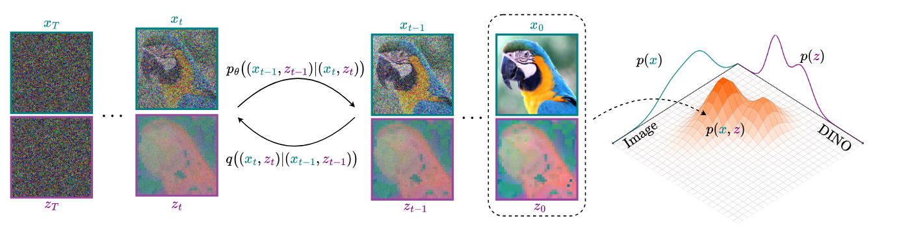
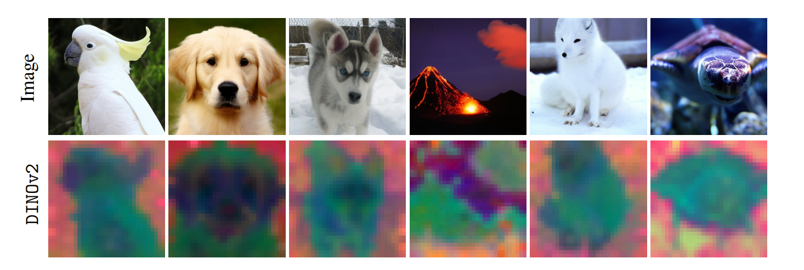

<!--             
<style>
  .texttt {
    font-family: Consolas; /* Monospace font */
    font-size: 1em; /* Match surrounding text size */
    color: teal; /* Add this line to set text color to blue */
    letter-spacing: 0; /* Adjust if needed */
  }
</style> -->

<h1 align="center">
   Boosting Generative Image Modeling via  
  <br> Joint
Image-Feature Synthesis
</h1>


<div align="center">
  <a href="https://scholar.google.com/citations?user=a5vkWc8AAAAJ&hl=en" target="_blank">Theodoros&nbsp;Kouzelis</a><sup>1,3</sup> &ensp; <b>&middot;</b> &ensp;
    <a href="https://scholar.google.com/citations?user=jif2JYsAAAAJ&hl=en" target="_blank">Efstathios &nbspKarypidis</a><sup>1,3</sup> &ensp; <b>&middot;</b> &ensp;
  <a href="https://scholar.google.com/citations?user=B_dKcz4AAAAJ&hl=el" target="_blank">Ioannis&nbsp;Kakogeorgiou</a><sup>1,6</sup> &ensp; <b>&middot;</b> &ensp;
    <br>
  <a href="https://scholar.google.fr/citations?user=7atfg7EAAAAJ&hl=en" target="_blank">Spyros&nbsp;Gidaris</a><sup>2</sup> &ensp; <b>&middot;</b> &ensp;
  <a href="https://scholar.google.com/citations?user=xCPoT4EAAAAJ&hl=en" target="_blank">Nikos&nbsp;Komodakis</a><sup>1,4,5</sup>  
  <br>
  <sup>1</sup> Archimedes/Athena RC &emsp; <sup>2</sup> valeo.ai &emsp; <sup>3</sup> National Technical University of Athens &emsp; <br>
  <sup>4</sup> University of Crete &emsp; <sup>5</sup> IACM-Forth &emsp; <sup>6</sup>  IIT, NCSR "Demokritos" &emsp;   <br>

<p align="center">
  <a href="https://representationdiffusion.github.io/">🌐 Project Page</a> &ensp;
  <a href="https://arxiv.org/abs/2504.16064">📃 Paper</a> &ensp;
  <br><br>
</p>




</div>


<br>


## 🔥 News

- \[2025/6/7\] **Training code for SiT w/ ReDi released!** 🎉 

## Setup

Download and set up the repo:

```bash
git clone https://github.com/zelaki/ReDi.git
cd ReDi
```

We provide an [`environment.yml`](environment.yml) file that can be used to create a Conda environment. 

```bash
conda env create -f environment.yml
conda activate ReDi
```

Weights for our pre-trained SiT model can be downloaded as follows:
```bash
mkdir pretrained_models
wget "https://www.dropbox.com/scl/fi/yi726j26yc57s4qhzgbtt/3000000.pt?rlkey=tcr8e0n9rrm12wfen44dkz00r&e=1&st=59cyam58&dl=1" -O pretrained_models/SiT-ReDi-XL-2-3M.pt
```


## Sampling


You can sample from our pre-trained ReDi models with [`sample.py`](sample.py).
```bash
python sample.py SDE --image-size 256 --seed 42 --ckpt /path/to/ckpt
```

### Sample and Evaluate
First download the [ImageNet reference batch from ADM](https://openaipublic.blob.core.windows.net/diffusion/jul-2021/ref_batches/imagenet/256/VIRTUAL_imagenet256_labeled.npz)

You can use sample_ddp.py script to samples a large number of images in parallel. This script generates a folder of samples as well as a .npz and directly uses with ADM's TensorFlow evaluation suite to compute FID, Inception Score and other metrics. For example, to sample 50K images from our pre-trained ReDi model over N run:
```bash
torchrun --nnodes=1 --nproc_per_node=8 --master-port 1312  sample_ddp.py SDE --model SiT-XL/2 --num-fid-samples 50000  --pca-rank 8 --ckpt pretrained_models/SiT-ReDi-XL-2-3M.pt --cfg-scale 2.4 --cfg-vae True --ref-batch VIRTUAL_imagenet256_labeled.npz
```


## Data Preprocessing

 First [download ImageNet](https://www.kaggle.com/competitions/imagenet-object-localization-challenge/data) and follow the  [preprocessing guide](https://github.com/sihyun-yu/REPA/tree/main/preprocessing) from REPA repository.

  #### DINOv2 PCA model
  We provide a pre-computed full rank [PCA model](/data2/ReDi/pcs/dino_pca_model.pth). You can adjust the number of PCs during training. 
  If you want to re-compute the PCA model you can use the following script:

  ```bash
  torchrun --nnodes=1 --nproc_per_node=1 calc_pca.py --feature-path "/path/to/your/local/features_dir"
  ```
  By default we use 300 batches with batch-size 256 for PCA.  


## Training

To train ReDi w/ SiT use the following script:

```bash
torchrun --nnodes 1 --nproc_per_node 8 train_redi.py \
  --model "SiT-XL/2" \
  --feature-path "/path/to/your/local/features_dir" \
  --pca-rank 8 \                                         
  --pca-model-path ./pcs/dino_pca_model.pth
```

Then this script will automatically create the folder in `results` to save logs and checkpoints. You can adjust the following options:

- `--models`: `[SiT-B/2, SiT-L/2, SiT-XL/2]`
- `--pca-rank`: Number of DINOv2 PC to use for joint training
- `--pca-model-path`: Path to precomputed PCA model
- `--dino-drop-prob`: Set to 0.2 if you plan to use Representation Guidance during inference 


## Acknowledgement

This code is mainly built upon [REPA](https://github.com/sihyun-yu/REPA), [SiT](https://github.com/willisma/SiT) and [fastDiT](https://github.com/chuanyangjin/fast-DiT) repositories.


## Citation

```bibtex
article{kouzelis2025boosting,
  title={Boosting Generative Image Modeling via Joint Image-Feature Synthesis},
  author={Kouzelis, Theodoros and Karypidis, Efstathios and Kakogeorgiou, Ioannis and Gidaris, Spyros and Komodakis, Nikos},
  journal={arXiv preprint arXiv:2504.16064},
  year={2025}
}
```


